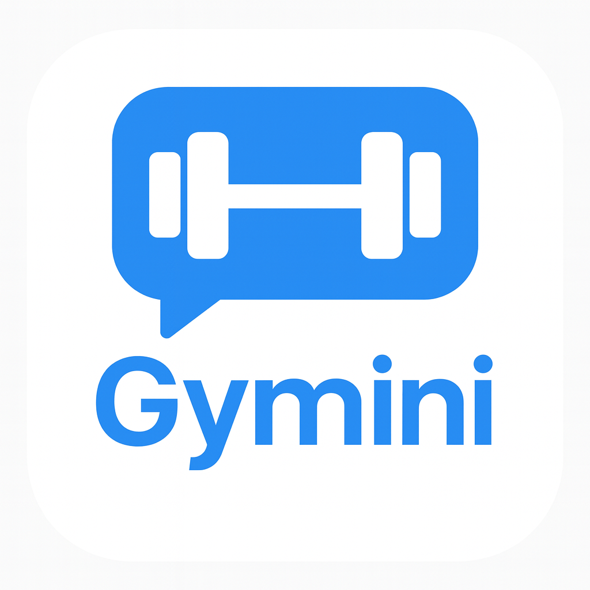

# 🏋️‍♂️ Gymini: AI 기반 맞춤형 운동 파트너

<div align="center">
  
  <br/><br/>
  
  
  
  <br/><br/>
  <strong>당신의 데이터를 학습하여 최적의 피트니스 루틴을 설계하는 스마트 헬스케어 솔루션</strong>
</div>

<br/>

---

## 📖 프로젝트 소개 (Project Overview)

Gymini는 “나에게 맞는 운동 루틴은 무엇일까?”라는 질문에서 출발한 AI 기반 개인 맞춤형 피트니스 코칭 플랫폼입니다.
단순히 운동을 기록하는 앱이 아니라, 사용자의 신체 데이터(InBody), 목표, 취향, 운동 패턴까지 분석하여 최적화된 운동 루틴을 자동 생성합니다.

Gymini는 다음을 제공합니다:
* AI 코치와 대화하며 루틴을 추천받는 대화형 운동 경험
* InBody 기반 정교한 신체 데이터 분석
* 세트·반복수·휴식까지 포함된 실행 가능한 루틴 설계
* 그래프 기반 성장 추적 및 동기 부여 시스템
* 다른 사람과 기록을 공유하는 커뮤니티 기반 피트니스 환경

운동을 혼자 하는 것이 아닌, AI가 옆에서 함께하는 운동 파트너가 되어드립니다.

---

## ✨ 핵심 기능 (Key Features)

### 🤖 1. AI 퍼스널 코칭 (AI Chatbot Integration)
* **LLM 기반 운동 코칭**<br/>
    자연어로 대화하면 Gymini가 신체 데이터와 히스토리를 기반으로 운동 루틴을 제안합니다.
* **개인화된 루틴 자동 생성**<br/>
    목표(다이어트, 벌크업, 체력 향상 등)에 따라 동적으로 플랜을 생성합니다.
* **Markdown 출력 지원**<br/>
    루틴을 깔끔한 포맷으로 제시하여 가독성을 높였습니다.

### 📊 2. 스마트 데이터 분석 (InBody Analysis)
* **세부 신체 지표 반영**<br/>
    골격근량, 체지방률, BMR 등 전문 지표를 기반으로 운동 강도와 루틴 구성에 활용합니다.
* **자동 계산 시스템**<br/>
    입력하지 않은 항목도 일부는 자동 계산되어 사용자 편의성을 높였습니다.
* **초기 체형 분석 기반 추천**<br/>
    초기에 입력한 신체 데이터 기반으로 기본 루틴을 구성합니다.

### 🏋️ 3. 체계적인 루틴 매니지먼트 (Routine Management)
* **운동 수행 트래킹**<br/>
    StopWatchTimer로 세트별 운동 시간과 휴식 시간을 정밀하게 추적합니다.
* **실행 가능한 자세한 루틴 제공**<br/>
    세트, 반복수, 휴식 시간, 운동 순서를 체계적으로 안내합니다.
* **운동 피드백 기반 추천 고도화**<br/>
    난이도·만족도·성취율을 반영하여 다음 루틴을 자동 조정합니다.

### 📈 4. 시각화된 통계 & 성장 시스템 (Statistics & Gamification)
* **직관적인 통계 그래프**<br/>
    fl_chart 기반 BMI 변화, 체중 변동, 운동 빈도 등 시각화 제공.
* **레벨/경험치 시스템**<br/>
    운동을 완료하면 EXP를 획득하며 지속적 동기 부여를 제공합니다.
* **Streak Calendar 지원**<br/>
    운동을 얼마나 꾸준히 하고 있는지 확인할 수 있는 캘린더 UI.

### 🌏 5. 피트니스 커뮤니티 (Community)
* **운동 기록 공유**<br/>
    유저 피드에서 다른 사람의 운동 기록을 보며 동기 부여.
* **유사 체형 기반 추천 루틴**<br/>
    나와 비슷한 체형/목표의 사용자가 수행한 루틴을 탐색할 수 있습니다.
* **댓글·반응 기능 확장 예정**<br/>
    점차 소셜 상호작용 기능을 강화해 나가고 있습니다.

---

## 🛠 기술 스택 (Tech Stack)

| Category          | Technology              | Description                          |
| ----------------- | ----------------------- | ------------------------------------ |
| **Framework** | Flutter                 | 크로스 플랫폼 UI 툴킷                |
| **Language** | Dart                    | Flutter를 지원하는 언어              |
| **State Management** | GetX                    | 반응형 상태관리 & DI                 |
| **Networking** | Dio                     | 빠르고 유연한 client 측 HTTP 요청 처리 |
| **Local Storage** | Flutter Secure Storage  | Secure token 및 민감 정보 저장       |
| **UI Components** | FL Chart                | 그래프/차트 시각화 라이브러리        |
| **Calendar** | Streak Calendar         | 운동 기록 시각화 캘린더              |

---

## 📂 프로젝트 구조 (Project Structure)

아키텍처는 Feature-first + Layered Architecture 혼합 형태입니다.

```plaintext
lib/
├── components/          # 공통 UI 컴포넌트
├── controllers/         # GetX 기반 비즈니스 로직 & 상태관리
│   ├── community_controller.dart
│   ├── routine_controller.dart
│   └── ...
├── models/              # 데이터 모델 및 JSON 직렬화
│   └── routine/
├── pages/               # 화면 단위 구성
│   ├── chat_page/
│   ├── community_page/
│   ├── login_page/
│   ├── personal_page/
│   ├── statistics_page/
│   └── ...
├── services/            # API / Storage / Auth 등 외부 연동
│   ├── dio/
│   └── http/
└── main.dart            # 앱 시작점
````

-----

## 🚀 시작하기 (Getting Started)

### 📌 Prerequisites

  * Flutter SDK ≥ 3.9.0
  * Dart SDK
  * Android Studio 또는 VS Code
  * (선택) iOS 빌드를 위한 Xcode

### 📦 설치 및 실행

1.  **레포지토리 클론**

    ```bash
    git clone -b develop [https://github.com/your-username/haropal_fe.git](https://github.com/your-username/haropal_fe.git)
    cd haropal_fe
    ```

2.  **패키지 설치**

    ```bash
    flutter pub get
    ```

3.  **환경 변수 설정**
    루트 경로에 `.env` 파일 생성 후 내용 입력:

    ```env
    API_BASE_URL=...
    OPENAI_API_KEY=...
    ```

4.  **앱 실행**

    ```bash
    flutter run
    ```

-----

## 🤝 기여 가이드 (Contributing)

Gymini 팀은 커뮤니티의 기여를 환영합니다\!

1.  **리포지토리 Fork**

    ```bash
    git fork
    ```

2.  **기능 브랜치 생성**

    ```bash
    git checkout -b feature/AmazingFeature
    ```

3.  **변경사항 커밋**

    ```bash
    git commit -m "Add AmazingFeature"
    ```

4.  **브랜치 Push**

    ```bash
    git push origin feature/AmazingFeature
    ```

5.  **Pull Request 생성**
    (PR 템플릿을 반드시 따라주세요)

-----

## 📝 라이선스

본 프로젝트는 MIT License를 따릅니다.
자세한 내용은 `LICENSE` 파일을 참고하세요.

-----

<div align="center"\>
Developed with ❤️ by the <strong\>Gymini Team</strong\>
<div\>
